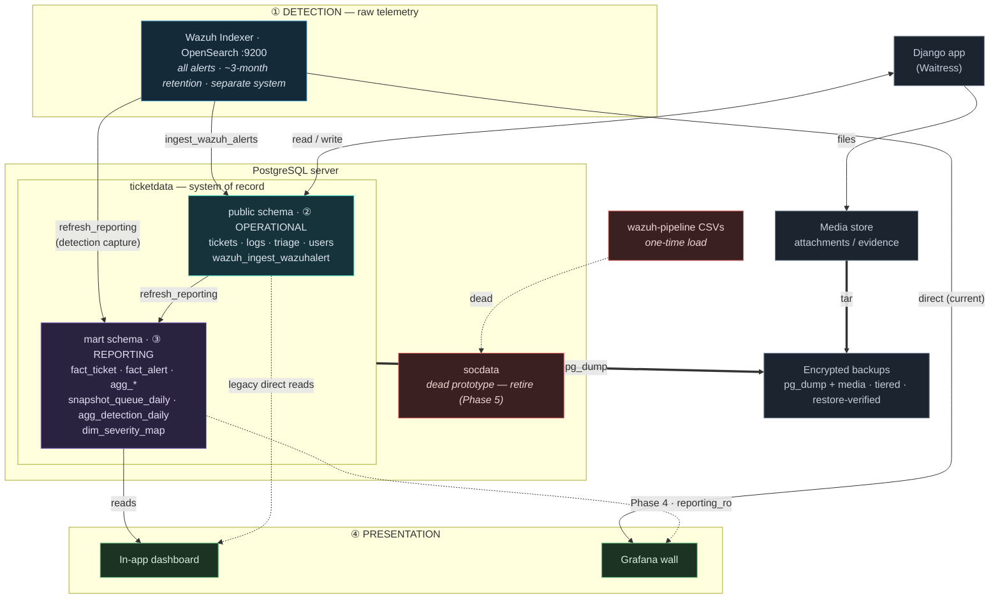

# Data Infrastructure — Current State

> **Audience:** developers, architects, operators · **Status:** Current (UAT / pre-launch) · **Last updated:** 2026-07-22

The whole data picture: every store, the flows between them, and how backup fits.
The system is organised as **four layers** — volume decreases and value-per-row
increases as you move up: ① detection → ② operational → ③ reporting → ④ presentation.

---

## Diagram

Solid = live flow · dashed = legacy / future / dead · thick = backup.

---

## Stores

| Store | Layer | Role | Notes |
|---|---|---|---|
| **Wazuh Indexer** (OpenSearch :9200) | ① | Raw alert telemetry | Separate system, ~3-month retention. Not in the app's backup. |
| **ticketdata · `public`** | ② | System of record | Cases, logs, triage, users, in-app alert triage. The crown jewels. |
| **ticketdata · `mart`** | ③ | Reporting | Pre-computed facts/aggregates + queue snapshot + detection capture + severity map. See [reporting-layer-design.md](reporting-layer-design.md). |
| **Media store** | ② | Attachment evidence | pcaps, screenshots, reports. Backed up with the DB. |
| **socdata** | — | **Dead** | Superseded May-2026 CSV→PG→Grafana prototype. Retire in Phase 5. |
| **postgres** | — | System | Default maintenance DB, empty. |

## Flows

- **`ingest_wazuh_alerts`** — pulls rule.level ≥ 10 alerts from the Indexer into
  `wazuh_ingest_wazuhalert` (the in-app triage slice — *not* a copy of all telemetry).
- **`refresh_reporting`** — refreshes the `mart` facts/aggregates from `public`,
  writes the daily queue snapshot, and captures per-day detection volume from the
  Indexer. Run it *after* the ingest.
- **Backup** — nightly encrypted `pg_dump` of `ticketdata` + a media tar; tiered
  retention; restore-verified. See [../operations/backup-and-restore.md](../operations/backup-and-restore.md).
- **Presentation** — the in-app dashboard reads `mart` (Phase 4 repoints Grafana
  from the Indexer onto `mart` via `reporting_ro`).

---

## How backup fits the layers

Backup priority follows the **derived-vs-snapshot** line drawn for the reporting
layer — protecting the operational store plus a few non-recomputable snapshots
protects the whole picture:

| Layer | Backup status |
|---|---|
| ① Detection (Indexer) | **Out of scope** — separate system, own retention |
| ② Operational (`public` + media) | **Fully backed up** — the irreplaceable core |
| ③ Reporting (`mart`) | **In the dump, but split:** derived views/matviews *recompute* (`refresh_reporting`); only `snapshot_queue_daily`, `dim_severity_map`, `agg_detection_daily` genuinely need it |
| ④ Presentation | **Nothing to back up** — stateless |

Because the Indexer expires (~3 months), the `agg_detection_daily` capture is
what turns ephemeral telemetry into permanent, backed-up history. Full mechanism,
restore procedure, and the "recreate roles on restore" gap:
[../operations/backup-and-restore.md](../operations/backup-and-restore.md).

---

## Environment

Currently **UAT / pre-launch**. The reporting layer and all flows above run
against the dev/UAT localhost **PostgreSQL 18.x** `ticketdata` (seed data, no
backups). **Production is Windows-native** — Windows Server + native
**PostgreSQL 18** + Waitress + IIS, with GPG-encrypted PowerShell backups and a
streaming standby (not Docker; see
[../operations/production-deployment.windows.md](../operations/production-deployment.windows.md)
and [../operations/backup-and-standby-handbook.windows.md](../operations/backup-and-standby-handbook.windows.md)).
Scheduling of `ingest_wazuh_alerts` and `refresh_reporting` (Windows Task
Scheduler), plus `reporting_ro`/Grafana, are cutover tasks — see
[../operations/reporting-layer-operations.md](../operations/reporting-layer-operations.md).
