# SOC End-to-End Workflow (v1.7.0, as implemented)

> **Audience:** SOC leads, analysts, developers · **Status:** Current · **Last updated:** 2026-09-18 (navigation model updated; workflow audited against the code)
> **Scope:** the whole path from a Wazuh alert or a manual report to a closed case, including every side-flow.
> **Editable diagram:** [soc-end-to-end-workflow-v1.7.0.drawio](soc-end-to-end-workflow-v1.7.0.drawio) (12 pages, role swimlanes; open in diagrams.net)
> **Status-machine authority:** [ticket-lifecycle-states.md](ticket-lifecycle-states.md) and `apps/incidents/models/ticket.py` → `Ticket.ALLOWED_TRANSITIONS`. If this page and the code disagree, the code wins.

**Role colors** — 🔵 Tier 1 · 🟣 Tier 2 · 🔴 SOC Manager · 🟠 System Admin · 🩷 System Owner · 🩵 Response Team · 🟢 Closed · ⚫ System

This page draws **what the code actually does**. Anything marked **⚠** is a place where the implementation differs from the intended workflow; those are listed again in [Known gaps](#known-gaps-). Dashed red arrows are step-back / send-back moves; gray arrows close a case as an Event.

> **Superuser:** can override role checks (act as creator, Tier 2 or manager; step back; ignore Tier 2 claims) but not the workflow gates (classification, `t1_route`, open Response Requests, monitor-once). Superuser is not drawn elsewhere.

---

## 1 · Main functions and page handoffs

The overview shows function boundaries. It intentionally leaves the internal decisions on pages 2–12. A numbered `Hnn` connector describes what crosses a page boundary; the same ID appears at the source and destination page in the editable diagram. `G1`, `K1`, `C1` and `R1` are supporting relationships, not ticket statuses.

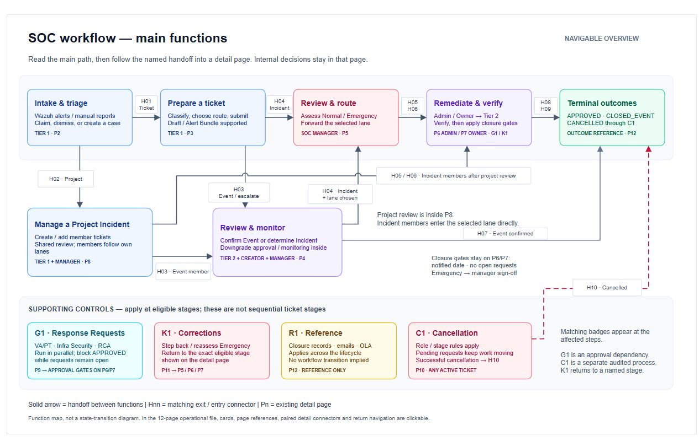

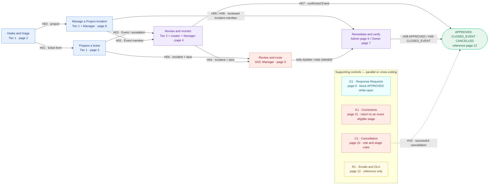

| Connector | Relationship between detail pages |
|---|---|
| `H01` | P2 → P3: open a ticket form from eligible claimed source(s); an Alert Bundle still produces one ticket |
| `H02` | P2 → P8: open Project Incident creation from an eligible source, or without a source |
| `H03` | P3/P8 → P4: submitted Event or escalation enters `ESCALATED_T2`; Event project members cannot be monitored |
| `H04` | P3/P4 → P5: Incident with Admin/Owner lane chosen enters `PENDING_MGR_TRIAGE` |
| `H05` | P5/P8 → P6: ADMIN route enters `AWAITING_CONTAINMENT` |
| `H06` | P5/P8 → P7: OWNER route enters `AWAITING_OWNER` |
| `H07` | P4 → outcome: confirmed Event closes as `CLOSED_EVENT`, including manager downgrade review where required |
| `H08` | P6/P7 → outcome: verified case closes as `APPROVED` after its notified-date, Response Request and Emergency gates pass |
| `H09` | P6/P7 → outcome: the separate reclassification action closes as `CLOSED_EVENT` |
| `H10` | P10 → outcome: a successful direct cancellation or approved request closes as `CANCELLED` |

The detailed draw.io pages include clickable **Back to main functions** links and a footer containing their incoming, outgoing and supporting connectors. Page 12 documents outcomes; following a connector to it does not add another execution stage.

## 2 · Intake (Tier 1)

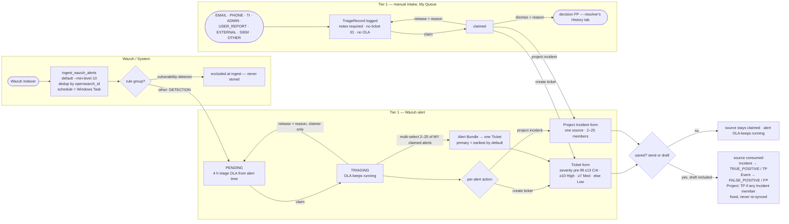

Only Tier 1 can use the triage queue, claim, release, convert and log manual intake. There is no "attach alert to an existing ticket" and no alert-level close button.

## 3 · Ticket creation and the Tier 1 decision

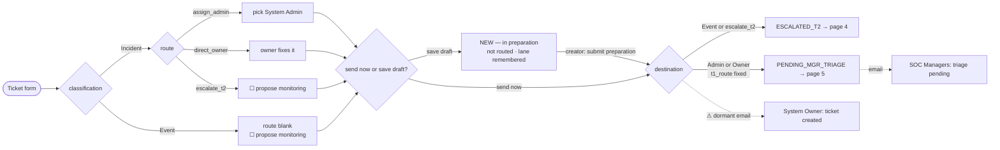

- The creator is the Tier 1 analyst who opened the ticket.
- Saving a draft already consumes the source alert / record (TP/FP) and starts the OLA clocks. Any SOC member may edit a draft; only the creator submits it.
- Project Incidents have no draft mode.
- ⚠ The System Owner emails never fire for form-created tickets: `Ticket.system_owner` is dormant and no form sets it.

## 4 · Tier 2 review and Monitoring

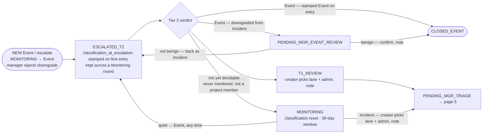

- **Tier 2 claim:** optional. Tier 2 acts on unclaimed tickets or ones it holds; a claim held by another Tier 2 analyst blocks them. Only the claimer can release (reason required); nobody can force-release.
- The creator may conclude Monitoring at any time; it is not tied to the 30-day expiry. No email on start.
- **Monitoring → Incident:** the creator picks the lane (Admin + assigned admin, or Owner) in the conclude form, same as T1_REVIEW; the edge is refused without one, so the case reaches the manager forwardable.
- **Monitoring → Event keeps the downgrade gate:** MONITORING blanks the live classification, but `classification_at_escalation` is *not* re-stamped on the MONITORING → ESCALATED_T2 re-entry (`transition_to`), so it still records how the case first reached Tier 2. A case escalated as an Incident therefore stays a downgrade after a quiet window and must go through PENDING_MGR_EVENT_REVIEW; only a case escalated as an Event closes directly.

## 5 · SOC Manager pre-containment review

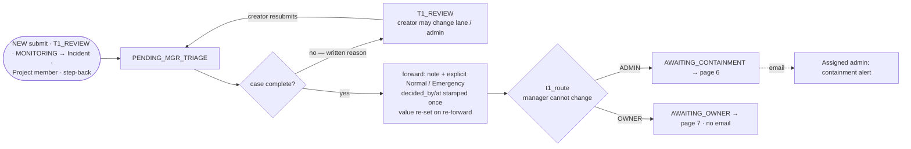

Project Incident members cannot be forwarded or returned individually until Project Review (page 8).

## 6 · Admin lane

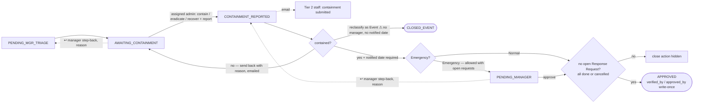

- The notified date is required only for approve / to-manager; it may not be in the future or earlier than detection / occurrence.
- **Wrong admin:** the manager cannot pick a new admin. Step back to PENDING_MGR_TRIAGE, then Return for completion → T1_REVIEW, where the Tier 1 creator assigns the new admin.
- ⚠ The System Owner "case closed" email is dormant.

## 7 · Owner lane

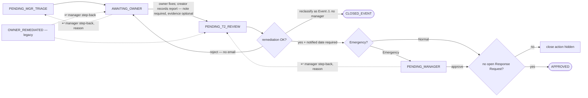

To change the lane, the manager steps back and then Returns for completion → T1_REVIEW; the Tier 1 creator chooses again.

## 8 · Project Incident

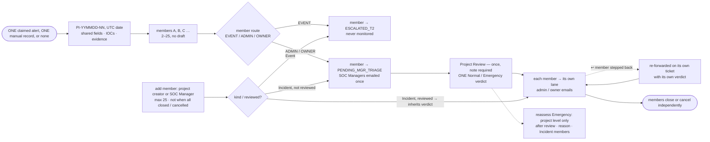

An all-Event project has no Project Review until the first Incident member is added.

## 9 · Response Requests and RCA

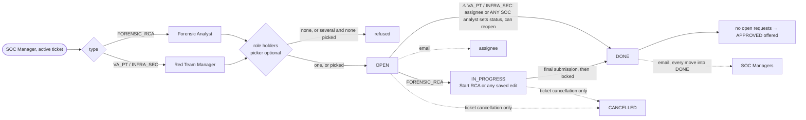

Open requests block only the edges into APPROVED; CLOSED_EVENT and PENDING_MANAGER are never blocked. Requests stay updatable after CLOSED_EVENT and freeze after APPROVED / CANCELLED; no new requests on closed tickets.

## 10 · Cancellation

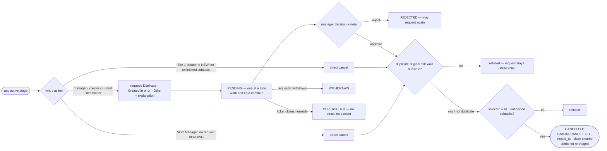

- A Tier 2 claim held by someone else blocks other Tier 2 analysts from requesting (never the manager).
- Email: a request goes to SOC Managers only; direct cancel / approve / reject / withdraw go to managers, requester, creator, assigned admin, system owner and every subtask assignee.

## 11 · SOC Manager corrections

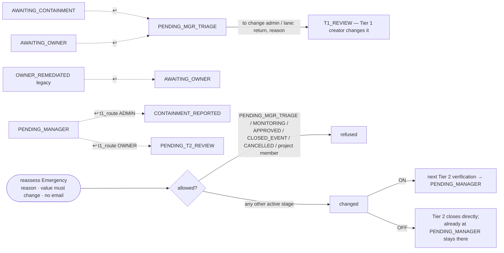

Step-back needs a reason, runs through `transition_to` (audit log, Tier 2 claim cleared), sends no email, keeps write-once stamps, and never applies to closed cases. The Emergency value is re-set at the next manager forward.

## 12 · Outcomes, emails and OLA

| Outcome | Stamps | Notes |
|---|---|---|
| `APPROVED` | `verified_by/at` (Tier 2 verifier), `approved_by/at` (closer), `closed_at` — all write-once | needs no open Response Request |
| `CLOSED_EVENT` | `closed_at` | Response Requests may outlive it |
| `CANCELLED` | `closed_at` (+ claim cleared) | excluded from resolution and MTTR stats |

| Email to | When |
|---|---|
| SOC Managers | → PENDING_MGR_TRIAGE (create, submit, T1 route, Monitoring → Incident, project create once, Incident member added before review) |
| Assigned Admin | → AWAITING_CONTAINMENT (manager forward, Project Review, member added after review, send-back with reason) |
| Tier 2 staff (fallback: `assigned_to`) | → CONTAINMENT_REPORTED (not on step-back) |
| Response assignee | Response Request created |
| SOC Managers | Response Request moves into DONE (every time) |
| SOC Managers | cancellation requested |
| Managers, requester, creator, assigned admin, system owner, subtask assignees | direct cancel / approve / reject / withdraw |
| ⚠ System Owner (dormant) | ticket submitted; → APPROVED / CLOSED_EVENT — `system_owner` is not set by any form |
| — no email — | ESCALATED_T2, T1_REVIEW, AWAITING_OWNER forward (single ticket), owner reject, → PENDING_T2_REVIEW, → PENDING_MANAGER, → PENDING_MGR_EVENT_REVIEW, Monitoring start / conclude Event, step-back, emergency reassess, SUPERSEDED |

**OLA:** DETECTION alerts have a 4-hour triage OLA from the alert timestamp until triaged. Tickets carry a containment deadline for Critical (4 h), High (24 h) and Unknown (4 h); Medium / Low have none, so no badge. Triage deadlines exist for every severity. Deadlines are set once at creation and hidden on terminal tickets.

---

## Scenario catalogue (every path)

Each line is the ordered status path. `→` is a forward move, `↩` a manager step-back, ⚠ a code gap.

### Intake
| # | Scenario | Path |
|---|---|---|
| I1 | Wazuh alert becomes a ticket | alert PENDING → claim TRIAGING → create ticket → saved (sent or draft) → alert TRUE_POSITIVE / FALSE_POSITIVE → ticket (page 3) |
| I2 | Analyst gives an alert back | TRIAGING → release by the claimer (reason) → PENDING → claimed again later |
| I3 | Several alerts, one case | claim each alert → multi-select 2–25 of your claimed alerts → one ticket (primary = earliest by default, 1 PRIMARY + SUPPORTING) → every alert gets the ticket's TP/FP |
| I4 | Alert affects many systems | one TRIAGING alert → Project Incident → members (page 8) |
| I5 | Manual report becomes a ticket | report → TriageRecord → claim → create ticket → decision TP / FP |
| I6 | Manual report is not a case | TriageRecord → claim → dismiss by the claimer (reason) → decision FP → resolver's History tab |
| I7 | Manual report affects many systems | TriageRecord → claim → Project Incident |
| I8 | Form abandoned | alert stays TRIAGING (OLA keeps running) / record stays claimed until released or used |
| I9 | Vulnerability-detector alert | excluded at ingest → never stored, never triaged |

### Tier 1 and Tier 2
| # | Scenario | Path |
|---|---|---|
| S1 | Draft first | NEW (in preparation; source already consumed) → creator submits → ESCALATED_T2 or PENDING_MGR_TRIAGE |
| S2 | Tier 1 says Event, Tier 2 agrees | NEW → ESCALATED_T2 → CLOSED_EVENT |
| S3 | Escalated Incident confirmed | NEW → ESCALATED_T2 → T1_REVIEW → PENDING_MGR_TRIAGE → lane |
| S4 | Tier 2 downgrades, manager agrees | NEW (Incident) → ESCALATED_T2 → PENDING_MGR_EVENT_REVIEW → CLOSED_EVENT |
| S5 | Tier 2 downgrades, manager disagrees | … → PENDING_MGR_EVENT_REVIEW → ESCALATED_T2 (Incident) → T1_REVIEW / MONITORING (if never monitored) / downgrade again |
| S6 | Monitoring turns into an Incident | ESCALATED_T2 → MONITORING → (creator picks lane + admin) PENDING_MGR_TRIAGE → lane |
| S7 | Monitoring stays quiet (escalated as Event) | ESCALATED_T2 (Event) → MONITORING → (creator, any time) ESCALATED_T2 as Event → CLOSED_EVENT — not a downgrade, closes directly |
| S8 | Second escalation after Monitoring | Monitor option is not offered again; Tier 2 must choose Event or Incident |
| S9 | Tier 2 claim conflict | a claim held by another Tier 2 analyst blocks the move; only the claimer can release (reason) |
| S10 | Monitoring stays quiet (escalated as Incident) | ESCALATED_T2 (Incident) → MONITORING (classification blanked, stamp kept) → creator concludes Event → ESCALATED_T2 → PENDING_MGR_EVENT_REVIEW → CLOSED_EVENT — still a downgrade, routes through the manager |

### SOC Manager review
| # | Scenario | Path |
|---|---|---|
| M1 | Incomplete case returned | PENDING_MGR_TRIAGE → T1_REVIEW (reason) → PENDING_MGR_TRIAGE |
| M2 | Normal Incident forwarded | PENDING_MGR_TRIAGE (note, Normal) → AWAITING_CONTAINMENT / AWAITING_OWNER |
| M3 | Emergency Incident forwarded | PENDING_MGR_TRIAGE (note, Emergency) → lane; the closing gate later goes through PENDING_MANAGER |

### Admin lane
| # | Scenario | Path |
|---|---|---|
| A1 | Normal, contained first time | AWAITING_CONTAINMENT → CONTAINMENT_REPORTED → APPROVED |
| A2 | Containment rejected, then OK | AWAITING_CONTAINMENT → CONTAINMENT_REPORTED → AWAITING_CONTAINMENT (× n) → CONTAINMENT_REPORTED → APPROVED |
| A3 | Emergency | … CONTAINMENT_REPORTED → PENDING_MANAGER → APPROVED |
| A4 | Found benign mid-containment | CONTAINMENT_REPORTED → CLOSED_EVENT (no manager, even if Emergency) |
| A5 | Wrong admin assigned | AWAITING_CONTAINMENT ↩ PENDING_MGR_TRIAGE → return → T1_REVIEW (creator assigns new admin) → PENDING_MGR_TRIAGE → AWAITING_CONTAINMENT |
| A6 | Manager wants more work | PENDING_MANAGER ↩ CONTAINMENT_REPORTED → (Tier 2 decides again) |
| A7 | Notified date missing | Tier 2 approve / to-manager refused until the date is entered |

### Owner lane
| # | Scenario | Path |
|---|---|---|
| O1 | Normal, fix accepted | AWAITING_OWNER → PENDING_T2_REVIEW → APPROVED |
| O2 | Fix rejected, then OK | AWAITING_OWNER → PENDING_T2_REVIEW → AWAITING_OWNER (× n) → PENDING_T2_REVIEW → APPROVED |
| O3 | Emergency | … PENDING_T2_REVIEW → PENDING_MANAGER → APPROVED |
| O4 | Found benign | PENDING_T2_REVIEW → CLOSED_EVENT (no manager) |
| O5 | Wrong lane / owner | AWAITING_OWNER ↩ PENDING_MGR_TRIAGE → return → T1_REVIEW (creator changes lane) → PENDING_MGR_TRIAGE → lane |
| O6 | Manager wants more work | PENDING_MANAGER ↩ PENDING_T2_REVIEW |
| O7 | Legacy ticket | OWNER_REMEDIATED → PENDING_T2_REVIEW → … (or ↩ AWAITING_OWNER) |

### Controls
| # | Scenario | Path |
|---|---|---|
| C1 | Response Request open at close | verified → (Emergency may still go to PENDING_MANAGER) → close action hidden → request DONE → APPROVED offered |
| C2 | Forensic RCA | request FORENSIC_RCA → Start RCA / first edit (IN_PROGRESS) → workspace → final submission (DONE, locked) |
| C3 | Event close with open request | CLOSED_EVENT allowed; request continues and can still be updated |
| C4 | Emergency switched on mid-lane | reassess (reason) → next Tier 2 verification routes to PENDING_MANAGER |
| C5 | Emergency switched off mid-lane | reassess (reason) → Tier 2 closes directly; a ticket already at PENDING_MANAGER stays for manager approval |
| C6 | Cancel a draft | NEW → Tier 1 creator direct cancel (no unfinished subtasks) → CANCELLED |
| C7 | Cancel by request, approved | request (PENDING) → manager approves, selecting all unfinished subtasks → CANCELLED |
| C8 | Cancel by request, rejected | request → REJECTED → work continues; may request again |
| C9 | Cancel request withdrawn | request → WITHDRAWN (requester only) |
| C10 | Case closed before decision | request PENDING → ticket APPROVED / CLOSED_EVENT → SUPERSEDED (no email) |
| C11 | Duplicate ticket | request reason Duplicate + original → approve re-checks original → CANCELLED (if invalid: refused, request stays PENDING) |
| C12 | Manager cancels directly | any active stage, no request PENDING → CANCELLED (all unfinished subtasks selected) |
| C13 | ⚠ Non-RCA request closed by anyone | any SOC analyst sets a VA_PT / INFRA_SEC request to DONE → APPROVED unlocked |

### Project Incident
| # | Scenario | Path |
|---|---|---|
| P1 | Mixed members | Event members → ESCALATED_T2; Incident members → PENDING_MGR_TRIAGE → Project Review (one verdict) → each to its own lane |
| P2 | Member added before review | Incident member → PENDING_MGR_TRIAGE, reviewed with the rest (only while Project Review hasn't happened) |
| P3 | Member added after review | Incident member inherits the verdict → straight to its lane (emails sent); Event member → ESCALATED_T2 |
| P4 | One member cancelled | that member → CANCELLED; group, shared evidence and alerts stay |
| P5 | Emergency changes for the incident | reassess at project level (member-level reassess refused) |
| P6 | Member stepped back after review | member ↩ PENDING_MGR_TRIAGE → forwarded on its own ticket with its own verdict |

---

## Known gaps ⚠

Places where the code differs from the intended workflow. They are drawn as implemented; fixing them is separate work.

1. **Non-RCA Response Requests can be completed by any SOC analyst** — `can_update_subtask` lets any SOC member set DONE (or reopen), which unlocks APPROVED.
2. **System Owner emails are dormant** — no form sets `Ticket.system_owner`.
3. **Mid-lane Event reclassification skips the manager**, even for Emergency tickets (a deliberate 2026-07-23 scope decision; see ticket-lifecycle-states.md).

*Closed 2026-09-18 — Event-downgrade gate bypass through Monitoring: `classification_at_escalation` is no longer re-stamped on the MONITORING → ESCALATED_T2 re-entry, so a case escalated as an Incident stays a downgrade after a quiet window and is routed through PENDING_MGR_EVENT_REVIEW (see §4, S10).*

## Related documents
- [ticket-lifecycle-states.md](ticket-lifecycle-states.md) — authoritative status machine and transition table
- [workflow-change-log.md](workflow-change-log.md) — why the workflow has this shape
- [../adr/0005-ticket-cancellation.md](../adr/0005-ticket-cancellation.md) — cancellation design
- [ticket-workflow-v1.5.0.drawio](ticket-workflow-v1.5.0.drawio) — superseded by the v1.7.0 file above
