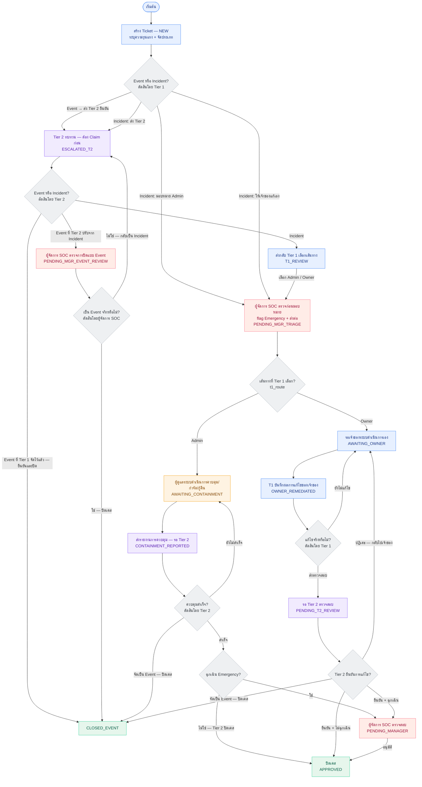

# Ticket Lifecycle States

> **Audience:** developers and SOC leads · **Status:** Current · **Last updated:** 2026-07-23
> **Source of truth:** `apps/incidents/models.py` → `Ticket.ALLOWED_TRANSITIONS`

The complete 13-state ticket lifecycle as a diagram plus a transition reference,
organised by which role may perform each move. When the state machine changes in
code, update the Mermaid block below — each line is one node or one arrow.

---

**Role colors** — 🔵 Tier 1 · 🟣 Tier 2 · 🟠 System Admin · 🔴 SOC Manager · 🟢 Closed

Key rules (redesigned 2026-07-14):
- **Every Incident passes the SOC Manager pre-containment review** (`PENDING_MGR_TRIAGE`) before it reaches a handling lane. The manager flags Emergency (yes/no) and forwards to the lane Tier 1 already chose (`t1_route`) — they **cannot** divert the lane.
- **Response-team requests run in parallel.** At any active stage the SOC Manager may spawn a Response Request (a specialised `TicketSubtask`): VA / Pentest and Infrastructure Security route to the **Red Team Manager**; Forensics / RCA routes to the **Forensic Analyst**. Each is auto-assigned to the sole holder of the target role (picker when several exist). **While any Response Request is not `DONE`, no path may move the Incident to `APPROVED`** — the closing action is withheld until the response work finishes. Event-close (`CLOSED_EVENT`) is exempt: a reclassified false alarm still closes and any open request simply outlives it.
- **Only the SOC Manager may set or clear the Emergency flag** (superuser bypass). It is decided as an **explicit, required Normal/Emergency assessment** at the pre-containment review (`assess_emergency_initial`, stamping `emergency_decided_by/at` write-once even for Normal). The manager may **reassess** it later (`reassess_emergency`) — an auditable action requiring a written reason — at any active stage past the review, but **not at `PENDING_MGR_TRIAGE`** and **not after closure** (`APPROVED`/`CLOSED_EVENT`). No other role can touch it. (2026-07-23)
- **Tier 1 can no longer close an Event directly.** A Tier 1 "Event" verdict escalates to Tier 2 (`ESCALATED_T2`); Tier 2 **confirms** it and closes (`CLOSED_EVENT`) with no SOC Manager involvement.
- **A Tier 2 Event *downgrade* needs the SOC Manager** (added 2026-07-23). If the ticket reached Tier 2 as an **Incident** and Tier 2 relabels it an Event, it goes to `PENDING_MGR_EVENT_REVIEW` instead of closing: the manager either confirms (→ `CLOSED_EVENT`) or rejects (→ back to `ESCALATED_T2` with the classification flipped back to Incident). This is a counter-measure — a case must not be disposable by reclassifying it. `classification_at_escalation` records what Tier 2 was handed, so *confirming* an Event Tier 1 had already classified still closes directly.
- **Tier 2 verifies every containment/remediation** — both the System Admin lane and the System Owner lane — before a ticket can close. Tier 2 may also **reclassify an in-flight case as an Event** and close it directly (no manager), even when the emergency flag is set. ⚠️ These two mid-containment edges are deliberately **not** covered by the downgrade gate above — a known asymmetry, see the change log.
- **Tier 2 must claim a ticket before acting on it** (added 2026-07-23). The Tier 2 Queue has claim/release like the Tier 1 triage queue; a claim held by another analyst blocks the transition in `transition_to`. The claim clears on every transition, since the queue spans three stages.
- **SOC Manager reviews emergency tickets only** at the closing gate (the `is_emergency` flag; severity alone never routes to the manager). Emergency tickets pass Tier 2 first, then the manager.
- System Owner never uses the system — Tier 1 records the owner's fix on their behalf.

## Transition reference (who can do what)

| From | To | Actor |
|------|----|-------|
| NEW | PENDING_MGR_TRIAGE (Incident) / ESCALATED_T2 (Event or Incident-escalate) | Tier 1 (creator) |
| ESCALATED_T2 | T1_REVIEW (Incident) / CLOSED_EVENT (Event Tier 1 already classified) / PENDING_MGR_EVENT_REVIEW (Event **downgraded** by Tier 2) | Tier 2 (must hold the claim) |
| PENDING_MGR_EVENT_REVIEW | CLOSED_EVENT (confirm) / ESCALATED_T2 (reject → classification back to Incident) | **SOC Manager** |
| T1_REVIEW | PENDING_MGR_TRIAGE | Tier 1 (creator) |
| PENDING_MGR_TRIAGE | AWAITING_CONTAINMENT (t1_route=ADMIN) / AWAITING_OWNER (t1_route=OWNER) | **SOC Manager** |
| AWAITING_CONTAINMENT | CONTAINMENT_REPORTED | Assigned Admin |
| CONTAINMENT_REPORTED | AWAITING_CONTAINMENT (ไม่สำเร็จ) / CLOSED_EVENT (จัดเป็น Event) / APPROVED (ไม่ฉุกเฉิน) / PENDING_MANAGER (ฉุกเฉิน) | **Tier 2** |
| AWAITING_OWNER | OWNER_REMEDIATED | Tier 1 (creator) |
| OWNER_REMEDIATED | AWAITING_OWNER (ยังไม่แก้ไข) / PENDING_T2_REVIEW (เสมอ) | Tier 1 (creator) |
| PENDING_T2_REVIEW | APPROVED (ไม่ฉุกเฉิน) / PENDING_MANAGER (ฉุกเฉิน) / CLOSED_EVENT (จัดเป็น Event) / AWAITING_OWNER (ปฏิเสธ) | **Tier 2** |
| PENDING_MANAGER | APPROVED | SOC Manager |

**Terminal states:** APPROVED, CLOSED_EVENT.

**`t1_route` routing:** Tier 1 records the chosen lane (`ADMIN` / `OWNER`) when it sends an Incident to `PENDING_MGR_TRIAGE`. The SOC Manager forward is deterministically guarded so it can only reach the lane matching `t1_route` — the manager reviews and flags Emergency but cannot swap Admin ↔ Owner.

**Manager routing at the closing gate:** `requires_manager_verification` = `is_emergency` only. Severity (even Critical) never routes to the manager by itself.

**Event closes and the manager:** there are now two different answers, and the distinction is the *origin* of the Event verdict, not the stage:

| Event close | Manager? | Why |
|---|---|---|
| `ESCALATED_T2 → CLOSED_EVENT` where Tier 1 had already classified it an Event | no | Tier 2 is confirming, not disposing |
| `ESCALATED_T2 → …` where Tier 2 downgraded an Incident | **yes** — via `PENDING_MGR_EVENT_REVIEW` | the case could otherwise be closed by relabelling it |
| `CONTAINMENT_REPORTED → CLOSED_EVENT` (mid-containment reclassify) | no | ⚠️ bypasses the manager even when Emergency is set |
| `PENDING_T2_REVIEW → CLOSED_EVENT` (owner lane reclassify) | no | ⚠️ same |

The two ⚠️ rows are a deliberate scope decision from 2026-07-23, not an oversight — but they are the same disposal risk one stage later, so revisit them if the gate proves useful.

**Tier 2 queue claim:** `t2_claimed_by` / `t2_claimed_at`. Claiming is a single conditional `UPDATE`, so simultaneous clicks cannot both win; releasing requires a written reason, logged against the ticket. `Ticket.t2_claim_blocks(user)` is enforced inside `transition_to`, so the guarantee holds for any caller. Only a claim held by *someone else* blocks — an unclaimed ticket stays actionable, because Tier 2 also works from the ticket detail page, which has no claim button.

**Response-team gate:** every edge into `APPROVED` is blocked while `Ticket.has_open_response_requests` is true (any VA/PT, InfraSec, or Forensics `TicketSubtask` not yet `DONE`). This covers the SOC Manager approval *and* the Tier 2 direct-close paths, so a non-emergency Incident with pending forensics cannot slip closed. `CLOSED_EVENT` is deliberately exempt. In the UI the closing action is withheld (not just rejected on submit) until the request completes. Response-team members (Forensic Analyst / Red Team Manager) see only the Tickets carrying a request assigned to them, worked from the **Response Requests** queue (`/incidents/response-requests/`).

**Sign-offs:** `verified_by` = the Tier 2 analyst who confirmed containment/remediation (stamped leaving CONTAINMENT_REPORTED or PENDING_T2_REVIEW forward to APPROVED/PENDING_MANAGER). `approved_by` = whoever closed the case (Tier 2 or SOC Manager).

**SOC Manager Queue** (ticket list, manager-scoped) shows all three manager stages: PENDING_MGR_TRIAGE (pre-containment review), PENDING_MANAGER (emergency approval) and PENDING_MGR_EVENT_REVIEW (Event-downgrade verification).

**Tier 2 Queue** (`/wazuh/escalation_queue/`) shows all three Tier 2 stages: ESCALATED_T2, CONTAINMENT_REPORTED, PENDING_T2_REVIEW — each row claimable, with an OLA countdown column.

**Tier 1 My Queue** (`/incidents/my-queue/`) is the Tier 1 counterpart: their own-court tickets (NEW, T1_REVIEW, AWAITING_OWNER, OWNER_REMEDIATED — `Ticket.TIER1_QUEUE_STATUSES`) plus the manual-intake queue. It exists because T1_REVIEW is creator-gated: when Tier 2 returns a case, only its opener may act, and before this page nothing told them.

**OLA countdown:** every queue shows the shared `_ola_badge.html` pill, built from `apps/incidents/ola.py`. Tickets use the live **contain** deadline; Wazuh alerts use their flat 4-hour triage OLA. The badge is hidden when there is no deadline (Medium/Low are notification-only) or the work is finished.

---

## Related documents

- [workflow-change-log.md](workflow-change-log.md) — *why* the state machine has this shape
- [../handover/engineering-handover.md](../handover/engineering-handover.md) §3.1 — the same lifecycle in prose, with the gotchas
- [../adr/0003-manager-verification-gate-in-model.md](../adr/0003-manager-verification-gate-in-model.md) — why the manager gate lives in the model
