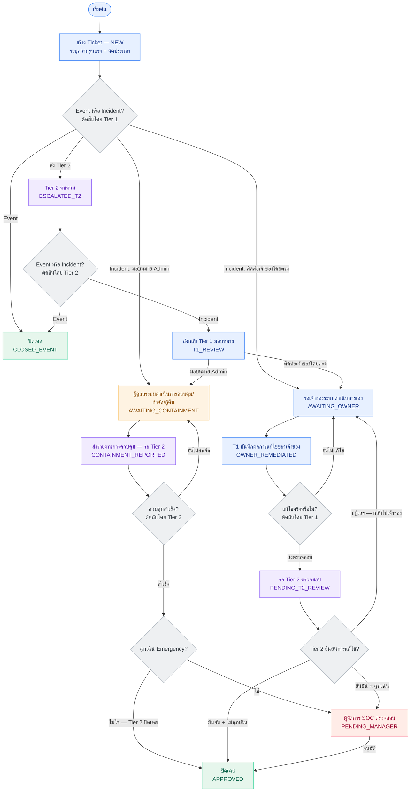

# SOC Ticket Workflow — by responsible role

Source of truth: `apps/incidents/models.py` → `Ticket.ALLOWED_TRANSITIONS`.
Edit the Mermaid block below; each line is one node or one arrow.

**Role colors** — 🔵 Tier 1 · 🟣 Tier 2 · 🟠 System Admin · 🔴 SOC Manager · 🟢 Closed

Key rules (redesigned 2026-07-08):
- **Tier 2 verifies every containment/remediation** — both the System Admin lane and the System Owner lane — before a ticket can close.
- **SOC Manager reviews emergency tickets only** (the `is_emergency` flag; severity alone never routes to the manager). Emergency tickets pass Tier 2 first, then the manager.
- System Owner never uses the system — Tier 1 records the owner's fix on their behalf.

## Transition reference (who can do what)

| From | To | Actor |
|------|----|-------|
| NEW | AWAITING_CONTAINMENT / AWAITING_OWNER / ESCALATED_T2 / CLOSED_EVENT | Tier 1 (creator) |
| ESCALATED_T2 | T1_REVIEW / CLOSED_EVENT | Tier 2 |
| T1_REVIEW | AWAITING_CONTAINMENT / AWAITING_OWNER | Tier 1 (creator) |
| AWAITING_CONTAINMENT | CONTAINMENT_REPORTED | Assigned Admin |
| CONTAINMENT_REPORTED | AWAITING_CONTAINMENT (ไม่สำเร็จ) / APPROVED (ไม่ฉุกเฉิน) / PENDING_MANAGER (ฉุกเฉิน) | **Tier 2** |
| AWAITING_OWNER | OWNER_REMEDIATED | Tier 1 (creator) |
| OWNER_REMEDIATED | AWAITING_OWNER (ยังไม่แก้ไข) / PENDING_T2_REVIEW (เสมอ) | Tier 1 (creator) |
| PENDING_T2_REVIEW | APPROVED (ไม่ฉุกเฉิน) / PENDING_MANAGER (ฉุกเฉิน) / AWAITING_OWNER (ปฏิเสธ) | **Tier 2** |
| PENDING_MANAGER | APPROVED | SOC Manager |

**Terminal states:** APPROVED, CLOSED_EVENT.

**Manager routing:** `requires_manager_verification` = `is_emergency` only. Severity (even Critical) never routes to the manager by itself.

**Sign-offs:** `verified_by` = the Tier 2 analyst who confirmed containment/remediation (stamped leaving CONTAINMENT_REPORTED or PENDING_T2_REVIEW forward). `approved_by` = whoever closed the case (Tier 2 or SOC Manager).

**Tier 2 Queue** (`/wazuh/escalation_queue/`) shows all three Tier 2 stages: ESCALATED_T2, CONTAINMENT_REPORTED, PENDING_T2_REVIEW.
